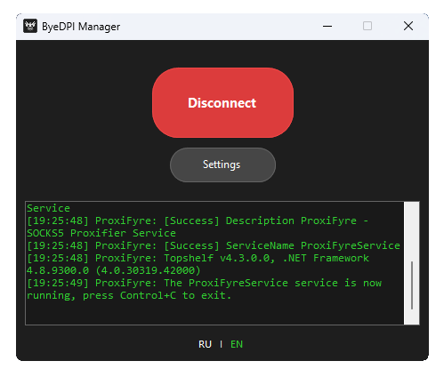

# ByeDPI Manager

[Русский](README.md) | English

A mini utility for running ByeDPI and ProxiFyre.

## Requirements

1. Windows 7+, [.NET Framework 4.7.2+](https://dotnet.microsoft.com/en-us/download/dotnet-framework/thank-you/net472-offline-installer)
2. [ProxiFyre](https://github.com/wiresock/proxifyre), [Windows Packet Filter](https://github.com/wiresock/ndisapi), [Visual C++ Redist 2022](https://learn.microsoft.com/en-us/cpp/windows/latest-supported-vc-redist?view=msvc-170#latest-microsoft-visual-c-redistributable-version)
3. [ByeDPI](https://github.com/hufrea/byedpi)

## Usage

1. Download and extract ByeDPI and ProxiFyre
2. Install Windows Packet Filter, it's required for ProxiFyre
3. Launch the utility
4. Specify paths to ByeDPI and ProxiFyre executables
5. Configure ByeDPI launch parameters
6. Add applications that should work through proxy
7. Save settings
8. You're awesome

## Used Libraries

1. [SocksSharp](https://github.com/extremecodetv/SocksSharp) 