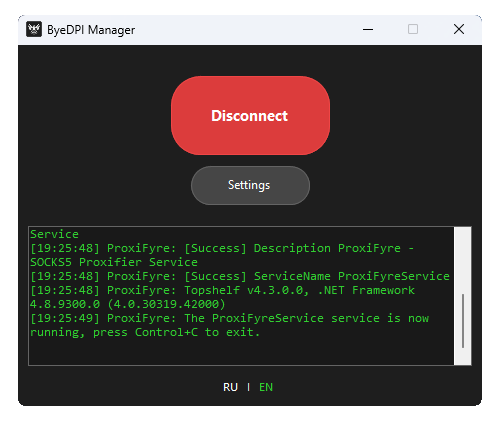

# ByeDPI Manager

[Русский](README.md) | English | [Türkçe](README.tr.md)

A small utility for running ByeDPI with routing through ProxiFyre or the Windows system proxy.



## Requirements

1. Windows 7 SP1+, [.NET Framework 4.8](https://dotnet.microsoft.com/en-us/download/dotnet-framework/net48)
2. For ProxiFyre mode: [ProxiFyre](https://github.com/wiresock/proxifyre), [Windows Packet Filter](https://github.com/wiresock/ndisapi), [Visual C++ Redist 2022](https://learn.microsoft.com/en-us/cpp/windows/latest-supported-vc-redist?view=msvc-170#latest-microsoft-visual-c-redistributable-version)
3. [ByeDPI](https://github.com/hufrea/byedpi)

## Installation

* Instructions from the community [ByeDPI Manager Manual](https://github.com/BDManual/ByeDPIManager-Manual)

### Option 1: All-in-One (Recommended for beginners)

This option includes all necessary components in a single archive.

1. **Download:**

   * Go to the release page: [https://github.com/romanvht/ByeDPIManager/releases/latest](https://github.com/romanvht/ByeDPIManager/releases/latest)
   * Download the `All_In_One_w64.zip` file

2. **Extraction:**

   * Locate the downloaded file on your computer
   * Right-click and select “Extract All…”
   * Choose an installation folder (e.g., `C:\APPS\ByeDPIManager`)

3. **Installing dependencies:**

   * Open the `redist` folder inside the extracted archive
   * Install both apps from this folder:

     * Windows Packet Filter (required for ProxiFyre)
     * Visual C++ Redistributable 2022

### Option 2: Manual Installation (For advanced users)

If you prefer managing components separately:

1. **Download components separately:**

   * [Manager](https://github.com/romanvht/ByeDPIManager/releases/latest)
   * [ByeDPI](https://github.com/hufrea/byedpi)
   * [ProxiFyre](https://github.com/wiresock/proxifyre)

2. **Install dependencies:**

   * [Windows Packet Filter](https://github.com/wiresock/ndisapi) (Required for ProxiFyre)
   * [Visual C++ Redistributable 2022](https://learn.microsoft.com/en-us/cpp/windows/latest-supported-vc-redist?view=msvc-170#latest-microsoft-visual-c-redistributable-version)

3. **Extract all components into convenient folders**

4. **Run and set paths:**

   * Specify the correct path to `ciadpi.exe` in the ByeDPI tab
   * Specify the correct path to `proxifyre.exe` under “Routing → ProxiFyre”

## Configuration

### Initial Setup

1. **Launch the program:**

   * Run `ByeDPI Manager.exe`
   * Click the "Settings" button

2. **Routing setup:**

   * Open the “Routing” tab
   * Select “ProxiFyre” (the default), “System proxy”, or “Disabled”
   * In ProxiFyre mode, specify the applications to route through the proxy

The local SOCKS5 proxy IP and port are configured on the “ByeDPI” tab. If a strategy already contains `-i`/`--ip` or `-p`/`--port`, those values are used, missing options are added at startup.

### Strategy Configuration

#### Using a predefined strategy

* Enter the desired strategy in the “Arguments” field on the “ByeDPI” tab

#### Strategy testing (optional)

If you don’t have a predefined strategy, you can use the built-in tester:

1. **Go to the tester tab:**

   * Open the “Strategy Test (Beta)” tab

2. **Start test:**

   * Click “Start”
   * The first time you run it, you’ll be asked to allow `ciadpi.exe` network access – click “Allow”

3. **Select a strategy:**

   * After the test completes, strategies with over 50% success will be listed in the log
   * Select the best one and copy it (Ctrl+C)

4. **Apply the strategy:**

   * Go back to the “ByeDPI” tab
   * Paste the copied strategy into the “Arguments” field (Ctrl+V)

5. **Customize testing (optional):**

   * Edit the files in the `proxytest` folder:

     * `sites.txt` – add your own sites to test
     * `cmds.txt` – add your own strategies to check

### Launch and Test

1. **Activate:**

   * In the main window, click “Connect”
   * The first time, ProxiFyre will ask for network access – click “Allow”

2. **Verify it’s working:**

   * Open a browser or app you configured
   * Check if the resources are accessible

## Troubleshooting

* If the app won’t start, ensure .NET Framework 4.8 is installed
* If bypassing doesn’t work, try a different strategy
* If connection issues occur, ensure Windows Packet Filter is installed properly
* Make sure your antivirus or firewall isn’t blocking the app

## Release build

To build the release, you need Windows, the .NET SDK with support for the `net48` project, and .NET Framework 4.8 Developer Pack.

Place the dependencies in the `redist` folder at the root of the project:

```text
redist/
  libs/
    byedpi/
      ciadpi.exe
    proxifyre/
      ...ProxiFyre files
  redist/
    VC_redist.x64.exe
    Windows.Packet.Filter.*.x64.msi
```

Run from the project root:

```powershell
powershell -NoProfile -ExecutionPolicy Bypass -File .\build-release.ps1
```

The script builds the project in the `Release` configuration and creates two files in `release`:

- `ByeDPI Manager.exe` - the standalone manager.
- `All_in_One_w64.zip` - a manager, dependencies, and libraries in a single archive.

The `proxytest` folder is taken from the project, `libs` and the installers are taken from the local `redist` folder.

## Special Thanks

* [ByeDPI](https://github.com/hufrea/byedpi)
* [ProxiFyre](https://github.com/wiresock/proxifyre)
* [Windows Packet Filter](https://github.com/wiresock/ndisapi)
* [SocksSharp](https://github.com/extremecodetv/SocksSharp)
