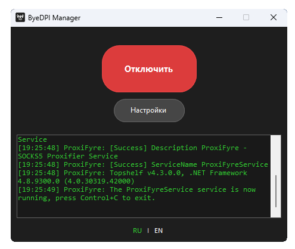

# ByeDPI Manager

Русский | [English](README.en.md) | [Türkçe](README.tr.md)

Мини-утилита для запуска ByeDPI с маршрутизацией через ProxiFyre или системный прокси Windows.

## Требования

1. Windows 7 SP1+, [.NET Framework 4.8](https://dotnet.microsoft.com/ru-ru/download/dotnet-framework/net48)
2. Для режима ProxiFyre: [ProxiFyre](https://github.com/wiresock/proxifyre), [Windows Packet Filter](https://github.com/wiresock/ndisapi), [Visual C++ Redist 2022](https://learn.microsoft.com/en-us/cpp/windows/latest-supported-vc-redist?view=msvc-170#latest-microsoft-visual-c-redistributable-version)
3. [ByeDPI](https://github.com/hufrea/byedpi)

## Инструкции

* Комплексная инструкция от комьюнити [ByeDPI Manager Manual](https://github.com/BDManual/ByeDPIManager-Manual)

### Вариант 1: All-in-One (Рекомендуется для начинающих)
Этот вариант включает все необходимые компоненты в одном архиве.

1. **Скачивание:**
   - Перейдите на страницу релизов: https://github.com/romanvht/ByeDPIManager/releases/latest
   - Скачайте файл `All_In_One_w64.zip`

2. **Распаковка:**
   - Найдите скачанный файл на компьютере
   - Нажмите правой кнопкой мыши и выберите "Извлечь все…"
   - Укажите папку для установки (например, `C:\APPS\ByeDPIManager`)

3. **Установка зависимостей:**
   - Перейдите в папку `redist` внутри распакованного архива
   - Установите оба приложения из этой папки:
     - Windows Packet Filter (необходим для работы ProxiFyre)
     - Visual C++ Redistributable 2022

### Вариант 2: Раздельная установка (Для опытных пользователей)
Если вы предпочитаете управлять компонентами отдельно:

1. **Скачайте компоненты отдельно:**
   - [Manager](https://github.com/romanvht/ByeDPIManager/releases/latest)
   - [ByeDPI](https://github.com/hufrea/byedpi)
   - [ProxiFyre](https://github.com/wiresock/proxifyre)

2. **Установите зависимости:**
   - [Windows Packet Filter](https://github.com/wiresock/ndisapi) (Необходим для работы ProxiFyre)
   - [Visual C++ Redistributable 2022](https://learn.microsoft.com/en-us/cpp/windows/latest-supported-vc-redist?view=msvc-170#latest-microsoft-visual-c-redistributable-version)

3. **Распакуйте все компоненты в удобные папки**

4. **Запустите и укажите пути**
   - Укажите правильный путь к файлу `ciadpi.exe` во вкладке ByeDPI
   - Укажите правильный путь к файлу `proxifyre.exe` в разделе «Маршрутизация → ProxiFyre»

## Настройка

### Первоначальная настройка

1. **Запуск программы:**
   - Запустите файл `ByeDPI Manager.exe`
   - Нажмите кнопку "Настройки"

2. **Настройка маршрутизации:**
   - Перейдите на вкладку «Маршрутизация»
   - Выберите «ProxiFyre» (режим по умолчанию), «Системный прокси» или «Выключена»
   - Для ProxiFyre укажите приложения, которые должны идти через прокси

IP и порт локального SOCKS5-прокси задаются на вкладке «ByeDPI». Если стратегия уже содержит `-i`/`--ip` или `-p`/`--port`, используются значения из стратегии, отсутствующие параметры добавляются при запуске.

### Настройка стратегии

#### Использование готовой стратегии
- В поле "Аргументы" на вкладке "ByeDPI" введите нужную стратегию

#### Подбор стратегии (опционально)
Если у вас нет готовой стратегии, вы можете воспользоваться подбором:

1. **Переход к тестированию:**
   - Перейдите на вкладку "Подбор стратегии (Beta)"

2. **Запуск теста:**
   - Нажмите кнопку "Старт"
   - При первом запуске появится запрос на разрешение доступа для `ciadpi.exe` к сети - нажмите "Разрешить"

3. **Выбор стратегии:**
   - После завершения теста в окне "Лог" будут показаны стратегии с успехом более 50%
   - Выделите лучшую стратегию мышкой и скопируйте её (Ctrl+C)

4. **Применение стратегии:**
   - Вернитесь на вкладку "ByeDPI"
   - В поле "Аргументы" вставьте скопированную стратегию (Ctrl+V)

5. **Настройка тестирования (опционально):**
   - Отредактируйте файлы в папке `proxytest`:
     - `sites.txt` - добавьте свои сайты для тестирования
     - `cmds.txt` - добавьте свои стратегии для проверки

### Запуск и проверка

1. **Активация:**
   - В главном окне нажмите кнопку "Подключить"
   - При первом запуске появится запрос на разрешение доступа для ProxiFyre к сети - нажмите "Разрешить"

2. **Проверка работы:**
   - Откройте браузер или приложение, которое указали в настройках
   - Проверьте доступ к ресурсам

## Решение проблем

- Если программа не запускается, убедитесь, что установлен .NET Framework 4.8
- Если не работает обход блокировок, попробуйте другую стратегию
- При проблемах с подключением проверьте, что Windows Packet Filter установлен корректно
- Убедитесь, что антивирус или брандмауэр не блокирует работу программы

## Большое спасибо

- [ByeDPI](https://github.com/hufrea/byedpi)
- [ProxiFyre](https://github.com/wiresock/proxifyre)
- [Windows Packet Filter](https://github.com/wiresock/ndisapi)
- [SocksSharp](https://github.com/extremecodetv/SocksSharp)
